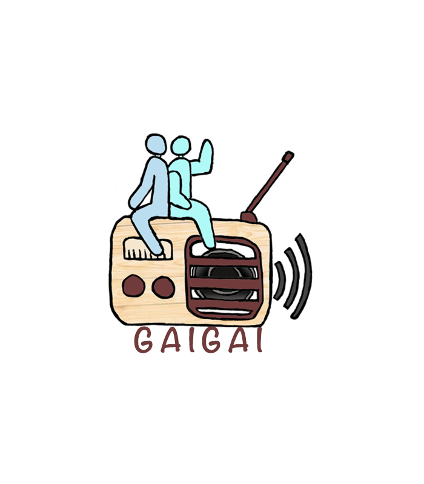
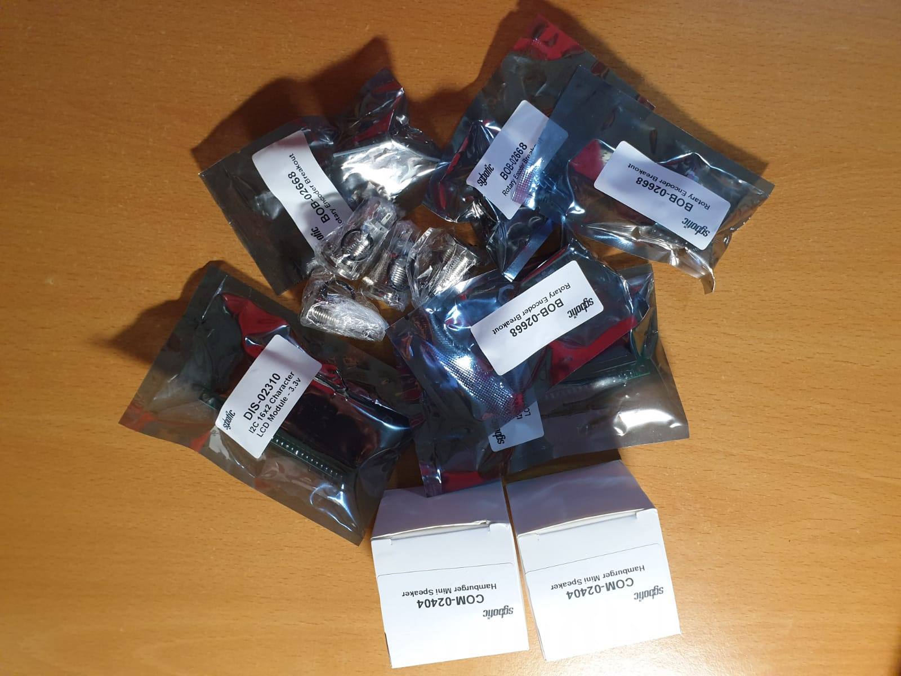
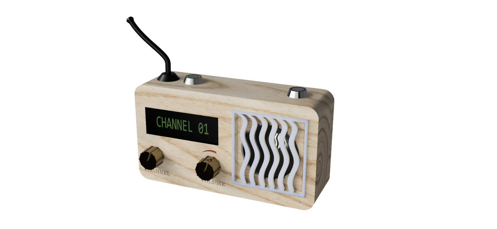
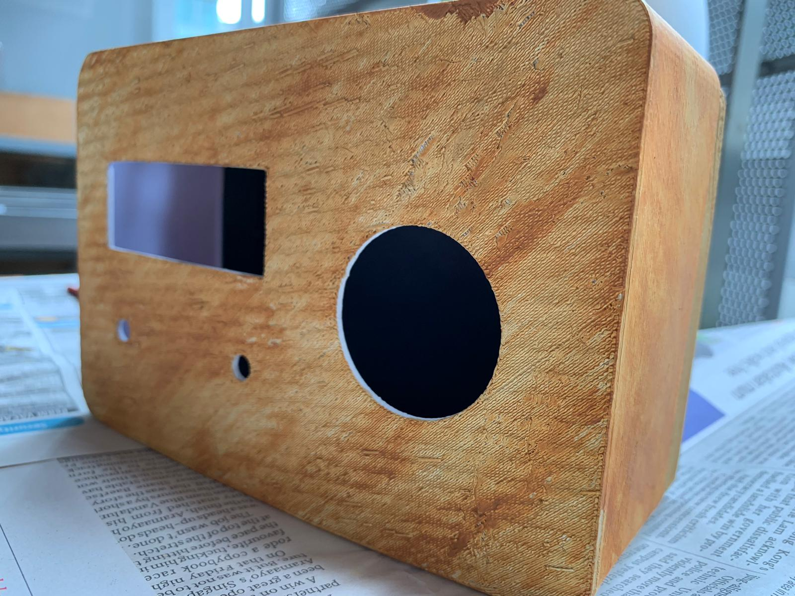

# GaiGai: Radio for the Soul

Hello! We are Team GaiGai, consisting of Sharon, Yong Hao, Yi Jie, and Yong Kuan.

## What is our purpose?

The GaiGai Radio aims to bridge the social gap between isolated
elderlies and their communities by gently surrounding them with the sounds of
a bustling community. Even if they live alone, this radio
ensures that they will never again be subject to the crippling silence of 
solitude within their own homes.

## What exactly is the GaiGai Radio?

The GaiGai Radio is exactly what it sounds like - it's a radio that live-streams
various channels for the user to tune in to. But here's the twist: instead of 
just listening to radio stars broadcasting their one-man shows, **everyone** who has a radio
can choose to participate in these streams. From everyday sounds to conversation or jokes,
these radios provide a platform for elderlies to reach out or keep in touch with others
who may be living near them. Over time, these radios aim to provide a stress-free
and convenient way to help isolated elderlies open up to their nearby communities, integrating them
back into society.

This radio:

- lets an elderly tune in to all available channels on a local server
- enables him / her to broadcast their own voice over the current channel
- is highly portable and can be easily carried around
- respects your privacy: the microphone can be easily muted with a click of a button!
- is fully anonymous and provides encryption over TCP-based VoIP communication servers
- **does not actually need to be in the form of a radio at all!** We provide an alternative 
way to simply run it using any computer with the correct installations

And most of all, everything from the hardware to software is entirely open-source, and easy to make. 

## How does it work?

The GaiGai radio functions through a server-client architecture: in the public implementation, once 
a radio is turned on, it first seeks out a central server to query for all available nearby servers 
in the radio's vicinity. Thereafter, once it receives a suitable server, it attempts to connect and
tunes the user into the first available channel. The streaming is handled via an open-source
VoIP implementation known as [Murmur](https://github.com/mumble-voip/mumble/tree/master/src/murmur),
and streaming is done using TCP to the client radio.

In this setup guide, however, we teach you how to create your own server and radio from scratch. The
radio will then directly connect to the server, which can be run on any suitable computing device.

## How do I make my own GaiGai Radio?

### Components
For a physical radio, you will need the following:

- 1 x Raspberry Pi Model 3 B
- 2 x Rotary encoders (One for the volume button, one for switching channels)
- 2 x 5V latching buttons (Power on/off switch, microphone mute)
- 1 x I2C LCD screen
- 1 x Jack-in Speaker
- 1 x USB Microphone (we recommend using a [boundary or conference microphone](https://en.wikipedia.org/wiki/Boundary_microphone))
- A 3D printer, or some cardboard crafting skills for making the case!
- (Optional) Acrylic paint, to jazz up the radio's exterior
- (Optional) Small pouch to hold the microphone if your chosen mic is limply wired, or if you opt for
earphones

For the server, you will need the following:

- Minimally, a local network for hosting streams
- A computing device to run as the server. In this case, we use another Raspberry Pi 4 to fulfill this role.
- Internet connection, if hosting the server over the internet

### Physical Casing

We have released the STL files that we used for 3D-printing the exterior radio casing in the 
[GitHub repository](https://github.com/SendorasLeft/GaiGai). Do feel free to use them, or modify
as necessary based on your chosen hardware dimensions. 

If a 
3D printer is not available, you may also make them out of other materials like cardboard.
(We do actually have an alternate version of the radio
 that was made from cardboard, so we're not pulling your leg here)
 
 After making the case, put your artistic skills to the test by decorating the case! 
 We personally recommend a wooden texture.
 
 
 
### Hardware Connections

### Setting up the Server

Pre-requisites: 
- A Raspberry Pi with a flashed OS. If you're not sure how to do this step, 
the Raspberry Pi Foundation has a great
starting guide [here](https://www.raspberrypi.org/downloads/).

Set up a server:

1. First, install the server dependencies by running `sudo apt-get install mumble-server`
2. Then, configure the autostart daemon by typing: `sudo dpkg-reconfigure mumble-server`. Choose yes to the following:
   - "AutoStart": Boot server on Pi startup 
   - "High Priority": Dedicate available resources to running the server if possible
   - "SuperUser": Enables the `SuperUser` admin account, which can help you to configure the server
3. Find out the ip address of your Pi. (Use the `ifconfig` command to help you)
4. Set the password for the admin account `SuperUser` 
   - run `sudo /usr/sbin/murmurd -ini /etc/mumble-server.ini -supw <password>`
4. Thereafter, configure your server details by running `sudo nano /etc/mumble-server.ini`
   - There are many things you can configure here. If you have time, we reccommend that you take
   a good look through many of the variables in this file since they are pretty self-explanatory and offer 
   some powerful customization over the server.

