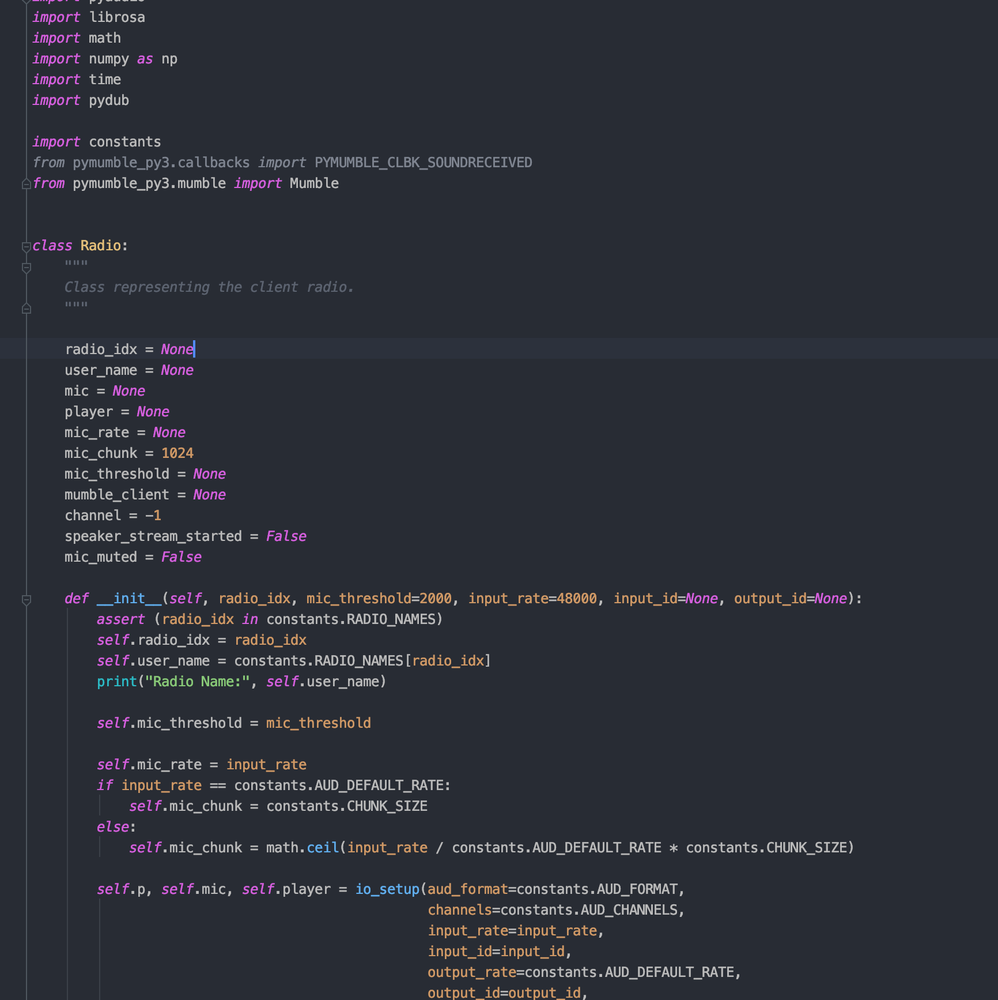
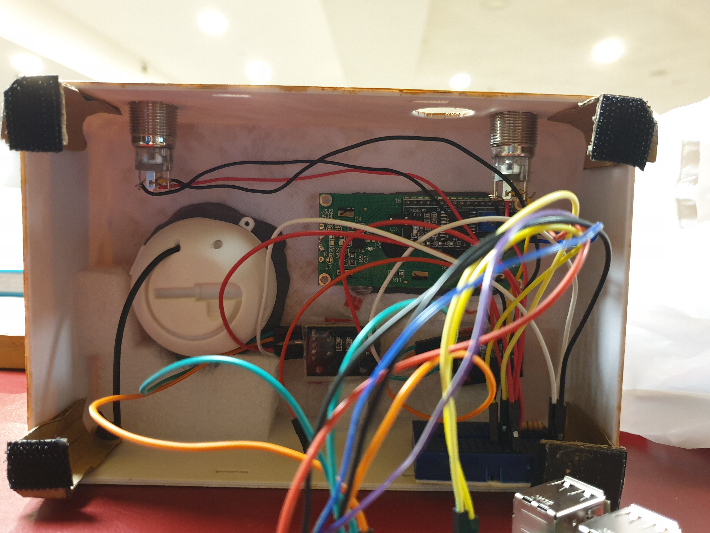

# GaiGai: A Radio for the Soul

Listen. Reconnect. Empower.
#

## The Team

Hello! We are Team GaiGai, consisting of:
 - Yi Jie (Computer Science)
 - Yong Hao (Materials Science & Engineering)
 - Sharon (Pharmacy)
- Yong Kuan (Engineering Science Programme)

## What is our purpose?

Our creation, the **GaiGai Radio**, aims to bridge the social gap between isolated
elderlies and their communities by gently surrounding them with the sounds of
a bustling community. Even if they live alone, this radio
ensures that they will never again be subject to the crippling silence of 
solitude within their own homes.

## What exactly is the GaiGai Radio?

The GaiGai Radio is exactly what it sounds like - it's a radio that live-streams
various channels for the user to tune in to. But here's the twist: instead of 
just listening to radio stars broadcasting their one-man shows, **everyone** who has a GaiGai Radio
can choose to participate in these streams. From everyday sounds to conversation or jokes,
these radios provide a platform for elderlies to reach out or keep in touch with others
who may be living near them. Over time, these radios aim to provide a stress-free
and convenient way to help isolated elderlies open up to their nearby communities, integrating them
back into society.

This radio:

- lets an elderly tune in to all available channels on a local server
- enables him / her to broadcast their own voice over the current channel
- is highly portable and can be easily carried around
- respects your privacy: the microphone can be easily muted with a click of a button!
- is fully anonymous and provides encryption over TCP-based VoIP communication servers
- **does not actually need to be in the form of a radio at all!** We provide an alternative 
way to simply run it using any computer with the correct dependencies

And most of all, everything from the hardware to software is entirely open-source, and easy to make. 

## How does it work?

The GaiGai radio functions through a server-client architecture: in the public implementation, once 
a radio is turned on, it first seeks out a central server to query for all available nearby servers 
in the radio's vicinity. Thereafter, once it receives a suitable server, it attempts to connect and
tunes the user into the first available channel. The streaming is handled via an open-source
VoIP implementation known as [Murmur](https://github.com/mumble-voip/mumble/tree/master/src/murmur),
and streaming is done using TCP to the client radio.

To simplify things for this setup guide, however, we will teach you how to create your own server and radio from scratch. The
radio will then directly connect to the server, which can be run on any suitable computing device.

## How do I make my own GaiGai Radio?

### Components
For a physical radio, you will need the following:

- 1 x Raspberry Pi Model 3 B
- 2 x Rotary encoders (One for the volume button, one for switching channels)
- 2 x 5V latching buttons (Power on/off switch, microphone mute)
- 1 x I2C LCD screen
- 1 x Jack-in Speaker
- 1 x Breadboard
- 1 x Blu Tack
- 1 x External PowerBank
- 1 x USB Microphone (we recommend using a [boundary or conference microphone](https://en.wikipedia.org/wiki/Boundary_microphone))
- Velcro, tape, and foam to hold the internal components together
- A 3D printer for the external casing (or some cardboard crafting skills!)
- (Optional) Acrylic paint, to jazz up the radio's exterior
- (Optional) Small pouch to hold the microphone if your chosen mic is limply wired, or if you opt for
earphones
- (Optional) Velcro and slingband to act as a handle / strap for carrying the radio around

For the server, you will need the following:

- Minimally, a local network for hosting streams
- A computing device to run as the server. In this case, we use another Raspberry Pi 4 to fulfill this role.
- Internet connection, if hosting the server over the internet

### Physical Casing

We have released the STL files that we used for 3D-printing the exterior radio casing in the 
[GitHub repository](https://github.com/SendorasLeft/GaiGai). Do feel free to use them, or modify
as necessary based on your chosen hardware dimensions. These files contain CAD models for the following:

- Front Casing
- Back Casing
- Rotary Knob Casings

If a 
3D printer is not available, you may also make them out of other materials like cardboard.
(We do actually have a very decent alternate version of the radio
 that was made from cardboard, so we're not pulling your leg here)
 
 
 After making the case, put your artistic skills to the test by decorating the case! 
 We personally recommend a wooden texture.
 
 
 
### Hardware Connections

We first need to wire up all the necessary components. Here is a full connection diagram you can follow
for the rotary encoders and latching buttons used for the radio:

 

In addition, we also need to set up the connections for the LCD screen. This portion
is going to be a little more complicated, but you can
You can follow [this
instructive guide](http://www.circuitbasics.com/raspberry-pi-i2c-lcd-set-up-and-programming/).

The connection diagram for the I2C LCD screen should look like the following. This can differ depending on your
exact model.

 

Lastly, remember to connect up your chosen microphone and speaker.

### Setting up the Server

**Pre-requisites:** 
- A Raspberry Pi with a flashed OS. If you're not sure how to do this step, 
the Raspberry Pi Foundation has a great
starting guide [here](https://www.raspberrypi.org/downloads/). Alternatively, you may also wish to check
out the [Murmur](https://github.com/mumble-voip/mumble/tree/master/src/murmur) documentation if you want
to set up the server on an alternate computing device.
- Connect to a suitable WiFi / ethernet port with local network or internet access

**Set up the server:**

1. First, install the server dependencies by running `sudo apt-get install mumble-server`
2. Then, configure the autostart daemon by typing: `sudo dpkg-reconfigure mumble-server`. Choose yes to the following:
   - "AutoStart": Boot server on Pi startup 
   - "High Priority": Dedicate available resources to running the server if possible
   - "SuperUser": Enables the `SuperUser` admin account, which can help you to configure the server
3. Find out the ip address of your Pi. (Use the `ifconfig` command to help you)
4. Set the password for the admin account `SuperUser` 
   - run `sudo /usr/sbin/murmurd -ini /etc/mumble-server.ini -supw <password>`
4. Thereafter, configure your server details by running `sudo nano /etc/mumble-server.ini`
   - There are many things you can configure here. If you have time, we recommend that you take
   a good look through many of the variables in this file since they are pretty self-explanatory and offer 
   some powerful customizations over the server. We suggest a few important ones below:
   - `Ctrl+W`, then type `mumble server` to jump to the relevant section. Uncomment it and replace with 
   the name of your server
   - `Ctrl+W`, then type `port` to locate the relevant section. By default the server will be started on 
   port `64738`. Change this if you wish to host the server on a different port (make sure you avoid the reserved ports!)
   -  `Ctrl+W`, then type `channel`to locate the relevant section. This is where you can default channels to the server.
5. Finally, run `sudo /etc/init.d/mumble-server restart` to restart the server with the new settings. If all of
the above was followed, the server should start anytime the Raspberry Pi is switched on.
6. (Optional) Set up port forwarding for global internet access to your server. Look up the instructions for your router model, and forward all messages
from your desired port to the IP address of the mumble server (which should have been discovered Step 3)
7. (Optional) Login as the SuperUser admin account to configure the server via [Mumble](https://www.mumble.com/mumble-download.php). This is for those
who don't like to browse through the configuration settings in Step 5.

### Setting up the Radio Software Backend

 

**Pre-requisites:** 
- A Raspberry Pi 3 Model B with a flashed OS. If you're not sure how to do this step, 
the Raspberry Pi Foundation has a great
starting guide [here](https://www.raspberrypi.org/downloads/).

Note: For simplification in this setup guide, we hard-code the the server details in `constants.py`.
Change them there if required (for example, if you set a different port or IP for your server). This
guide assumes that five channels were created on the server.

**Install Dependencies:**
 Here, we install all packages needed to run the radio.
 - Update package lists
    - `sudo apt-get update`
    - `sudo apt-get dist-upgrade`
 - PortAudio (purpose: audio streaming)
    - `sudo apt-get install libasound-dev`
    - `sudo apt-get install portaudio19-dev`
 - PyAudio (purpose: audio streaming)
    - `sudo pip3 install pyaudio`
    - `sudo apt-get install python3-pyaudio`
 - librosa (purpose: audio resampling & compression)
    - `sudo apt install libblas-dev llvm python3-pip python3-scipy`
    - `sudo apt install python3-protobuf`
    - `sudo pip3 install numpy --upgrade `
    - `sudo apt-get install python3-pandas`
    - `sudo apt-get install python3-sklearn`
    - `sudo apt-get install libatlas-base-dev`
    - `sudo pip3 install librosa==0.4.2`
 - pydub (purpose: audio stream mixing)
    - `sudo pip3 install pydub`
 - pyalsaaudio (purpose: volume control)
    - `sudo pip3 install pyalsaaudio`

**NOTE: Do not install or clone the pymumble library directly. We use a slightly modified version of 
the written pymumble API for efficiency, which is included in this repository itself.**

**Clone the repository:**

Of course, we need to get the actual radio scripts for our radio. Here, we clone
it into the home directory of the Raspberry Pi.
    - `cd ~`
    - `git clone https://github.com/SendorasLeft/GaiGai`

**Headless setup:**

Since the Raspberry Pi will run inside the radio, it does not need to boot into
a fancy GUI. Here are the steps that will allow it to boot directly into the terminal:
    - `raspi-config`
    - Go to Boot Options, then select the option to boot into terminal **without** a password

**Run radio script on startup:**

Finally, we configure the python3 script to run on startup. There are many ways to do this, but
the simplest way is to add it to your bashrc confiuration file, since we're starting the RPi in
headless mode anyway.
    - `echo "sudo python3 ~/GaiGai/driver_client.py <RADIO_IDX>" >> ~/.bashrc`
    - Note: Replace `<RADIO_IDX>` above with an integer from 0 to 5. You can add more IDs via
    the `constants.py` file.
  
**Alternative: Run on Linux computer without hardware**

We provide a simplified script to start the radio on a computer if you do not wish to start
up the hardware. Note that at this point, the script does not support hardware functions like
channel switching or volume control etc.
    - To start the script, run `python3 driver_pc.py <RADIO_IDX>`
  
  
And you're done with the RPi software setup! The only thing left to do now is to bring it all together.

### Bringing It Altogether

 

Fit all the electronics within the case. There really isn't much we can do to guide you here, but
here are a few tips:

- Use blu-tack to fit the electronic components like the LCD screen or latching buttons
into their grooves
- Use a layer of acrylic tape to hold electronics down after they are secured
- Use packing foam to further support the electronics and fill up empty spaces
- Use Velco with cardboard to create latching handles for the back case to attach to the front 
- Fit all the electronic accessories inside first, then connect them to the Raspberry Pi towards the end.
- Don't forget to connect the power bank, microphone, and speaker before you close up the radio.
- (Optional) Use Velcro to tape on a suitable strap for carrying the radio around!
- (Optional) Use Velcro to tape on a suitable back pouch at the backc of the radio for holding small items

And there you have it, your own **GaiGai Radio**!

 

## Credits

This project is licensed under the [GNU General Public License v3.0](LICENSE).

We would also like to acknowledge the maintainers of the open-source VoIP server
[Murmur / Mumble](https://github.com/mumble-voip/), as well as its corresponding [client-side
python API](https://github.com/azlux/pymumble) started by [Robert904](https://github.com/Robert904),
and currently being actively maintained by [azlux](https://github.com/azlux).

Lastly, we would to thank NUS and the organizers of 
[Makerthon 2020](https://blog.nus.edu.sg/makerthon2020/competition-theme/), without
whom this project would not have been possible.
